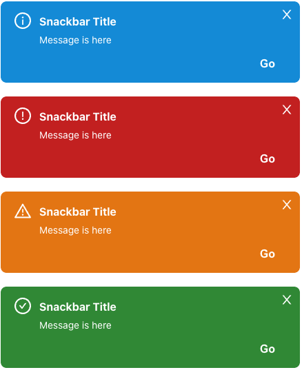
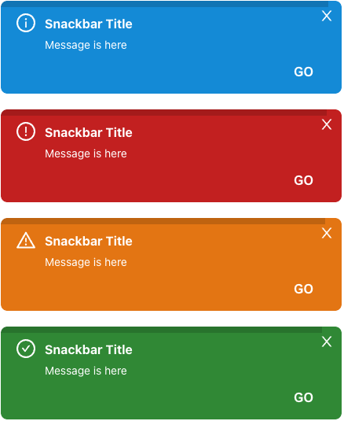

# Example

| without timer progressbar | with timer progressbar |
| ------------- | ------------------------------ |
|  |  |

<br />

# Getting Started

**Installation**

```javascript
$ npm i react-snackbar-ui-customizable
or
$ yarn add react-snackbar-ui-customizable
```

<br />

# Features

## Snackbar Provider Setup

To use snackbar, you must wrap the `SnackbarContextProvider` at the top of your application

```
import { SnackbarContextProvider } from 'react-snackbar-ui-customizable'

const App = () => {
  return (
    <SnackbarContextProvider>
      {children}
    </SnackbarContextProvider>
  )  
}
```

## Snackbar Usage

Then you can use it by declaring it in a react hook method inside the component you need.

```
import { useSnackbar } from 'react-snackbar-ui-customizable'

const Example = (): JSX.Element => {
  const snackbar = useSnackbar();

  return (
    <button onClick={() => snackbar.on({ title: 'snackbar title', message: 'this is snackbar message' })}>
      Show Snackbar!
    </button>
  )
}

```

<br />

# API

## SnackbarContextProvider

(* Required)
| property name | Description | Type |
| ------------- | ------------------------------ | --------- |
| `id` | portal id. (default: snackbar-portal) | string |
| `option` | portal options | OptionType |
| `children*` | your application components | JSX.Element |

### option (all of the option property is optional) - OptionType

| property name | Description                                                                                                | Type |
| ------------- | ---------------------------------------------------------------------------------------------------------- | ---- |
| `position`    | will be displayed (top-left, top-center, **top-right(default)**, bottom-left, bottom-center, bottom-right) | string     |    
| `zIndex`      | z index (default: 100)                                                                                     | number     |
| `duration`    | 0: infinity, 1 ~ : for the given time, snackbar appears and disappears (default: 3s)                       | number(second(s))     |
| `successIcon` | Success Icon (default: CheckCircleOutlined of @ant-design/icon)                                         | React.ReactNode \| JSX.Element |
| `errorIcon`   | Error Icon (default: WarningOutlined of @ant-design/icon)                                               | React.ReactNode \| JSX.Element |
| `warnIcon`    | Warning Icon (default: ExclamationCircleOutlined of @ant-design/icon)                                   | React.ReactNode \| JSX.Element |
| `infoIcon`    | Information Icon (default: InfoCircleOutlined of @ant-design/icon)                                      | React.ReactNode \| JSX.Element |
| `closeIcon`   | Close Icon (default: CloseOutlined of @ant-design/icon)                                                 | React.ReactNode \| JSX.Element |

## useSnackbar

| property name | Description                                            | Type |
| ------------- | ------------------------------------------------------ | ---- |
| `on`          | execution method for stacking snackbars on list        | (option: SnackbarOption) => void |
| `off`         | excution method for removing snackbars on list         | (id: number) => void |
| `length`      | length of snackbar list                                | number |
| `list`        | snack bar list currently being displayed on the screen | Array<Option> |

### Snackbar Option (when you use on method of useSnackbar)
| property name | Description                                                                                                | Type |
| ------------- | ---------------------------------------------------------------------------------------------------------- | ---- |
| `id`    | snackbar unique id (default: auto generation using uuid())  | string    |    
| `title`    | snackbar title  | string     |    
| `message*`    | snackbar message  | string     |    
| `type`    | snackbar type  | 'SUCCESS' \| 'ERROR' \| 'WARN' \| 'INFO'  |    
| `onClose`    | event for close snackbar  | (id: string) => void |    
| `buttonText`    | action button text located on the bottom right  | string     |    
| `onClickButton`    | action function when clicking action button, (caution) this property is always used with buttonText property  | () => void     |    
| `duration`    | 0: infinity, 1 ~ : for the given time, snackbar appears and disappears (default: 3s)                       | number(second(s))     |
| `successIcon` | Success Icon (default: CheckCircleOutlined of @ant-design/icon)                                         | React.ReactNode \| JSX.Element |
| `errorIcon`   | Error Icon (default: WarningOutlined of @ant-design/icon)                                               | React.ReactNode \| JSX.Element |
| `warnIcon`    | Warning Icon (default: ExclamationCircleOutlined of @ant-design/icon)                                   | React.ReactNode \| JSX.Element |
| `infoIcon`    | Information Icon (default: InfoCircleOutlined of @ant-design/icon)                                      | React.ReactNode \| JSX.Element |
| `closeIcon`   | Close Icon (default: CloseOutlined of @ant-design/icon)                                                 | React.ReactNode \| JSX.Element |


<br />

# Guide

1. Local option setting value is always applied before global option setting value.
   - **In the example below, the duration is set to 10, which is set locally.**

```
<SnackbarContextProvider
  id="snackbar-portal-unique-id"
  option={{ duration: 0 }}
>
  <Example />
</SnackbarContextProvider>

...
import { useSnackbar } from 'react-snackbar-ui-customizable'

const Example = (): JSX.Element => {
  const snackbar = useSnackbar();

  return (
    <button onClick={() => snackbar.on({ title: 'snackbar title', message: 'this is snackbar message', duration: 10 })}>
      Show Snackbar!
    </button>
  )
}
```

<br />

# CSS Style

type is one of the injected snackbar type (SUCCESS, ERROR, WARN, INFO)

## Snackbar Container

`className: snackbar-container snackbar-container--{type}`

## Snackbar box

`className: snackbar-box snackbar-box--{type}`

## Snackbar progressbar

`className: snackbar-progressbar snackbar-progressbar--{type}`

## Snackbar title

`className: snackbar-title snackbar-title--{type}`

## Snackbar description

`className: snackbar-description snackbar-description--{type}`

## Snackbar button

`className: snackbar-button snackbar-button--{type}`
